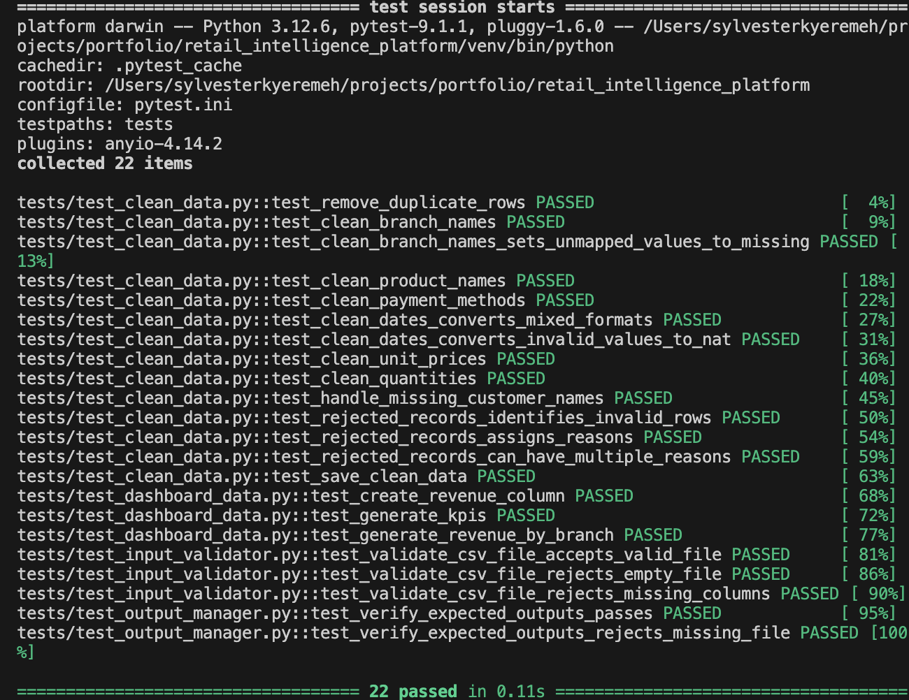

# BrightMart Retail Intelligence Platform


## Overview

The BrightMart Retail Intelligence Platform is an automated retail data-processing and reporting solution built with Python.

It converts inconsistent monthly sales CSV files into clean, validated, analysis-ready datasets and produces dashboard outputs, business insights, and management reports.

The project demonstrates how manual spreadsheet-based reporting can be transformed into a repeatable, reliable, and maintainable business automation workflow.

## Business Problem

BrightMart receives monthly sales exports from multiple branches. The raw files contain common data-quality issues, including:

- inconsistent date formats
- inconsistent branch and product names
- currency symbols and commas in price fields
- duplicate transactions
- missing customer names
- invalid quantities
- incomplete or malformed records

Manually correcting these issues every month is time-consuming and creates a risk of inconsistent reporting.

The Retail Intelligence Platform automates the entire process.

## Solution

The platform performs the following workflow:

1. Validates incoming CSV files.
2. Combines approved files into one dataset.
3. Standardises branch, product, and payment-method names.
4. Converts dates, quantities, and prices into appropriate data types.
5. Removes duplicate records.
6. Separates invalid records for review.
7. Generates a clean master sales dataset.
8. Creates dashboard-ready analytical datasets.
9. Produces business insights and summary reports.
10. Verifies all expected outputs before publishing them.
11. Preserves previous production outputs if a run fails.

## Key Features

### Data Validation

The platform checks:

- whether input files exist
- whether files are valid CSV files
- whether required columns are present
- whether files contain records
- whether required output files were generated
- whether output files are non-empty

### Data Cleaning

The cleaning pipeline handles:

- duplicate records
- mixed date formats
- currency symbols
- thousands separators
- invalid numeric values
- inconsistent branch names
- inconsistent product names
- inconsistent payment methods
- missing customer names

### Rejected-Record Tracking

Records that fail important business rules are separated from the clean dataset and assigned a rejection reason.

Examples include:

- invalid transaction dates
- missing quantities
- zero quantities
- negative quantities

### Dashboard Datasets

The pipeline generates analytical datasets for:

- executive KPIs
- revenue by branch
- revenue by product
- monthly revenue trends
- top customers
- revenue by payment method

### Business Reporting

The reporting workflow generates:

- a clean master sales dataset
- dashboard-ready CSV files
- business insights
- pipeline execution summaries
- failure reports
- operational logs

### Safe Publishing

All new outputs are initially generated inside a staging directory.

The files are published to the production output directory only after the complete workflow succeeds and all expected outputs pass verification.

This protects users from incomplete or partially generated reports.

### Automated Testing

The project uses `pytest` to test:

- revenue calculations
- KPI generation
- branch-level aggregation
- input validation
- duplicate removal
- data standardisation
- date conversion
- unit-price conversion
- rejected-record detection
- output verification
- output-file creation

### Continuous Integration

GitHub Actions automatically runs the test suite whenever changes are pushed or a pull request is created.

### Docker Support

The project includes a Dockerfile so the reporting workflow can run in a consistent containerised environment.

## Project Architecture

```text
retail_intelligence_platform/
├── .github/
│   └── workflows/
│       └── tests.yml
│
├── config/
│   ├── __init__.py
│   └── settings.py
│
├── data/
│   ├── raw/
│   ├── processed/
│   └── staging/
│
├── logs/
├── reports/
│
├── src/
│   ├── cleaning/
│   ├── dashboard/
│   ├── insights/
│   ├── pipeline/
│   ├── reporting/
│   ├── utils/
│   └── validation/
│
├── tests/
│   ├── conftest.py
│   ├── test_clean_data.py
│   ├── test_dashboard_data.py
│   ├── test_input_validator.py
│   └── test_output_manager.py
│
├── .dockerignore
├── .gitignore
├── Dockerfile
├── pytest.ini
├── README.md
├── requirements.txt
├── requirements-dev.txt
└── setup_brightmart.command


## Technology Stack


Python 3.12
pandas
openpyxl
pytest
Docker
GitHub Actions
Excel
Power Query


## Installation

### 1. Clone Repository

```
git clone <repository-url>
cd retail_intelligence_platform
```


### 2. Create a Virtual Environment

```
python3 -m venv venv

```

Activate it on macOS or Linux:

```
source venv/bin/activate
```

Activate it on Windows
```
venv\Scripts\activate
```

### Install Runtime Dependencies

```
pip install --upgrade pip
pip install -r requirements.txt
```

For development and testing:
```
pip install -r requirements-dev.txt
```

## Input Data

Place the raw monthly CSV files in:
```
data/raw/
```

Each file should contain the required columns

transaction_date
branch
product
quantity
unit_price
customer_name
payment_method


## Running the Complete Reporting Workflow

From the project root, run:

```
python -m src.reporting.run_reporting_pipeline
```

The workflow will:

1. validate the raw input files
2. clean and combine the data
3. create dashboard datasets
4. generate business insights
5. verify all staged outputs
6. publish successful outputs
7. generate an execution summary

## Running the Cleaning Pipeline Only

```
python -m src.pipeline.run_pipeline
```

## Running the Dashboard Pipeline Only

```
python -m src.dashboard.generate_dashboard_data
```

## macOS Launcher

macOS users can run the setup or launcher file:

```
chmod +x setup_brightmart.command
./setup_brightmart.command
```

The launcher creates the required environment, verifies dependencies, validates input files, and runs the reporting workflow.


## Generated Outputs

Successful pipeline outputs are published to:

```
data/processed/
```

Typical outputs include:

master_sales.csv
dashboard_kpis.csv
revenue_by_branch.csv
revenue_by_product.csv
monthly_revenue.csv
payment_methods.csv
top_customers.csv

Execution summaries are stored in:

reports/

Application logs are stored in:

logs/

## Running Tests

Run the complete test suite:

```
pytest -v
```

Run a specific test module:

```
pytest tests/test_clean_data.py -v
```

Run tests with concise output:

```
pytest -q
```

## Code Quality

Format the project with Black:

```
black .
```

Sort imports:

```
isort .
```


Run style checks:

```
flake8 src tests
```


## Running with Docker

Build the image:

```
docker build -t brightmart-retail-intelligence .
```

Run the container:

```
docker run --rm brightmart-retail-intelligence
```

For local data access, mount the project data and reports directories:

```
docker run --rm \
  -v "$(pwd)/data:/app/data" \
  -v "$(pwd)/reports:/app/reports" \
  -v "$(pwd)/logs:/app/logs" \
  brightmart-retail-intelligence
```

## Screenshots

### Executive Dashboard


### Successful Pipeline Execution


### Automated Test Suite



## Continuous Integration

The GitHub Actions workflow runs automated tests on:
pushes to the main branch
pull requests
updates to the project code

The workflow configuration is stored in:

```
.github/workflows/tests.yml
```

## Data Protection

The repository should contain only synthetic, anonymised, or approved demonstration data.
Real customer names, transaction records, personal information, credentials, and confidential business information should not be committed to GitHub.


## Business Value

The platform helps a retail organisation:
- reduce monthly reporting time
- improve data consistency
- detect invalid records early
- protect published reports from incomplete pipeline runs
- create reusable dashboard datasets
- improve management visibility
- establish a repeatable reporting process
- reduce dependency on manual Excel cleaning


## Potential Extensions

Future versions could include:
- interactive Power BI or Tableau dashboards
- automated email distribution
- database integration
- cloud storage integration
- scheduled monthly execution
- Streamlit management dashboard
- API-based data ingestion
- anomaly detection
- sales forecasting
- customer segmentation
- branch performance alerts


## Project Status

Version: 1.0.0

The core reporting pipeline is complete and operational.
Completed capabilities include:
- validation
- cleaning
- rejected-record handling
- dashboard dataset generation
- reporting
- logging
- staging
- output verification
- atomic publishing
- automated testing
- continuous integration
- containerisation


## Author

Sylvester Kyeremeh
IT Project Manager, Business Analyst and Data Automation Professional

Key areas:
- Python automation
- data cleaning and reporting
- business analysis
- dashboard development
- project management
- process improvement


## Licence
This project is available under the MIT Licence.

Copyright (c) 2026 Sylvester Kyeremeh
